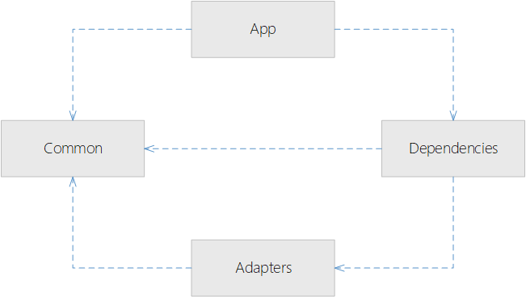

# AzureFunctionsDependencyInjection
This is a sample solution to show how you can do dependency injection in Azure Functions.  The project is structured in a way to achieve isolation of dependencies from the Azure Function app.

## Techonology
 - Visual Studio 2017
 - .NET Standard 2.0
 - Azure Functions SDK, version >= 1.0.26
 - 

## Motivation
Now that Azure Functions SDK supports defining functions within a non-static class, we can inject dependencies into those class instances.

This lets us more easily test our app by substitutin mocks or stubs for those dependencies that c external systems, such as databases, logging, HTTP calls, etc.

Also this project shows how we can automatically register public types within our assemblies.

## Project Structure
 - Adapters: Contains a service implementation.  You would normally put your adapters here that connect to external systems.
 - Common: Defines the service interfaces.  You would normall put your business logic here.
 - Dependencies: This is the middle layer between the Function app and the adapters.  Contains the service registration code.
 - FunctionApp: Our Azure Function application which contains a single function and some injected services.



## Usage

Dependencies registered via a Startup class:
```
using Dependencies;
using Microsoft.Azure.WebJobs;
using Microsoft.Azure.WebJobs.Hosting;

[assembly: WebJobsStartup(typeof(FunctionApp.Startup))]
namespace FunctionApp
{
    internal class Startup : IWebJobsStartup
    {
        public void Configure(IWebJobsBuilder builder)
        {
            builder.AddModule(new AdapterModule())
                   .AddModule(new DomainModule());
        }
    }
}
```

Where `AdapterModule` registers the dependencies within the `Adapters` assembly, and `DomainModule` registers the ones in the `Common` assembly.

The actual registration of the services is done in ech module using the NetCore.AutoRegisterDi extension methods:
```
using Adapters;
using Microsoft.Azure.WebJobs;
using Microsoft.Extensions.DependencyInjection;
using NetCore.AutoRegisterDi;

namespace Dependencies
{
    public class AdapterModule : IModule
    {
        public void Configure(IWebJobsBuilder builder)
        {
            this.ConfigureServices(builder.Services);
        }

        private void ConfigureServices(IServiceCollection services)
        {
            // Service can be registered manually, for example:
            // services.AddTransient<ITransientGreeter, Greeter>();
            // services.AddScoped<IScopedGreeter, Greeter>();
            // services.AddSingleton<ISingletonGreeter, Greeter>();

            // A new instance will be created each time the dependency is required
            // (eg if injected into an Azure function via a constructor, then a
            // new instance will be created each time the Azure function is called)
            services.RegisterAssemblyPublicNonGenericClasses(typeof(MyService).Assembly)
                .AsPublicImplementedInterfaces(ServiceLifetime.Transient);
        }
    }
}
```

Finally our dependencies are injected into our function app class via the constructor:
```
public class MyFunction
{
    // The services that are injected via constructor
    private readonly IMyService myService;
    private readonly IAnotherService anotherService;
    private readonly INestedService nestedService;

    public MyFunction(
        IMyService myService,
        IAnotherService anotherService,
        INestedService nestedService)
    {
        this.myService = myService;
        this.anotherService = anotherService;
        this.nestedService = nestedService;
    }
    
    // etc
}
```
